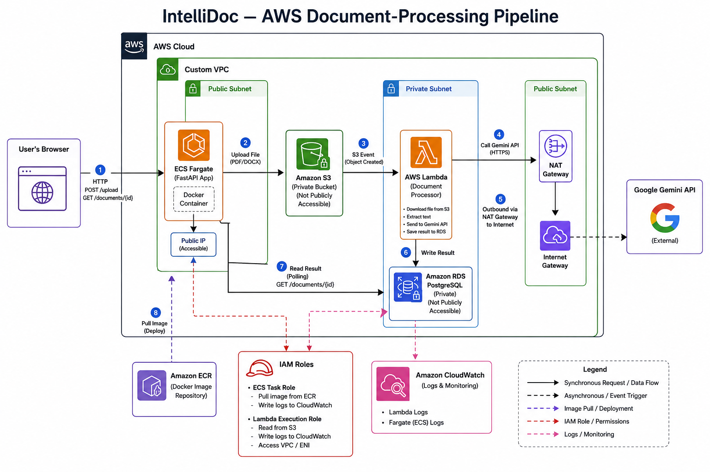
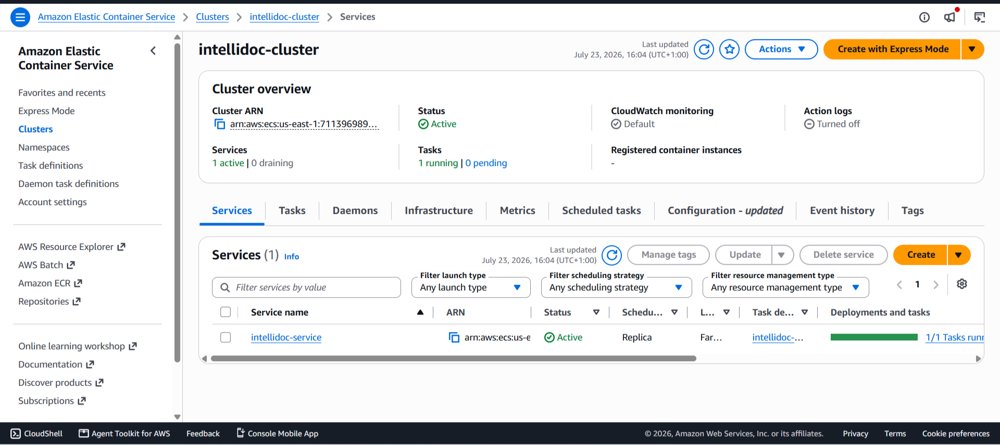
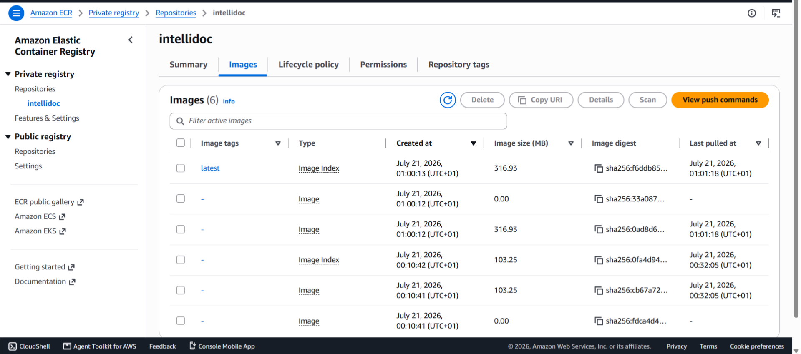
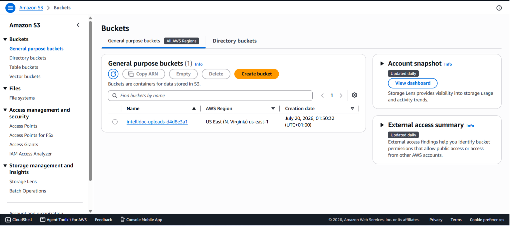
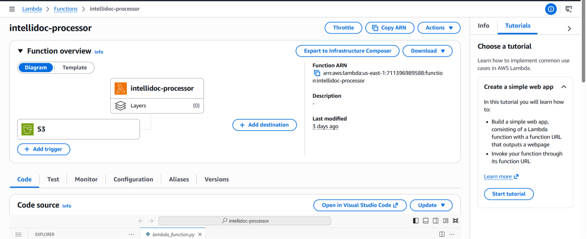
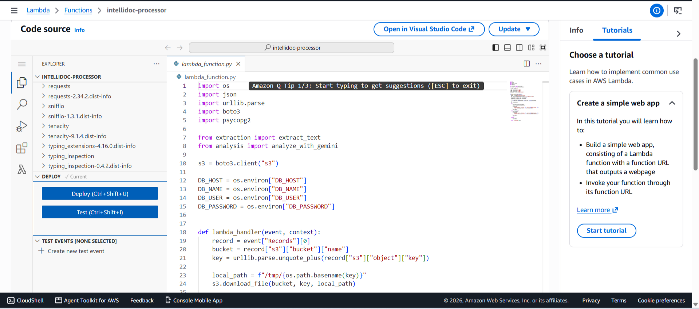
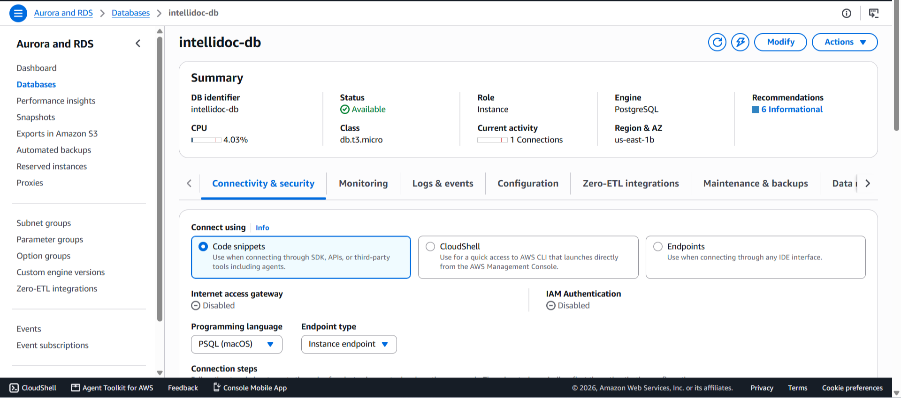

# Infrastructure

This document covers the cloud infrastructure behind IntelliDoc, including the AWS services used, the networking architecture, deployment workflow, Infrastructure as Code (IaC), monitoring, and operational considerations.

---

# Architecture Overview

IntelliDoc follows an event-driven architecture deployed entirely on AWS. User requests are served by an ECS Fargate application, while document processing is handled asynchronously through Amazon S3 and AWS Lambda. Processed results are stored in Amazon RDS for retrieval through the API.

> **Screenshot:** Overall architecture diagram





---

# AWS Services Used

## Amazon ECS (Fargate)

Amazon ECS Fargate hosts the FastAPI application without requiring EC2 instance management. The container serves the frontend, exposes the REST API, and communicates with Amazon RDS.

**Why it was chosen**

* Serverless container hosting
* No EC2 administration
* Automatic task isolation
* Easy deployment from Amazon ECR

> **Screenshot:** ECS Cluster / Service





---

## Amazon ECR

Amazon Elastic Container Registry stores Docker images used by ECS deployments.

**Why it was chosen**

* Native integration with ECS
* Secure private image repository
* Versioned container images

> **Screenshot:** ECR Repository





---

## Amazon S3

Uploaded documents are stored in an S3 bucket before processing.

**Why it was chosen**

* Durable object storage
* Event notifications for Lambda
* Cost-effective document storage

> **Screenshot:** S3 Bucket





---

## AWS Lambda

Lambda processes uploaded documents after S3 events are triggered. It extracts text, invokes the AI model, and stores the processed result.

**Why it was chosen**

* Event-driven execution
* Pay-per-use pricing
* Automatic scaling
* No server management

> **Screenshot:** Lambda Function








---

## Amazon RDS (PostgreSQL)

Amazon RDS stores processed document metadata and AI analysis results.

**Why it was chosen**

* Managed PostgreSQL database
* Automated backups
* Reliable persistent storage
* Native integration within the VPC

> **Screenshot:** RDS Instance





---

## IAM

IAM roles and policies provide secure access between AWS services.

The project uses IAM to:

* Allow ECS tasks to pull images from ECR
* Allow Lambda to access S3
* Allow Lambda to write CloudWatch logs
* Grant only the permissions required for each service (principle of least privilege)

---

## Amazon CloudWatch

CloudWatch provides centralized logging and monitoring for ECS tasks and Lambda executions.

It was primarily used during development to diagnose deployment failures and verify successful document processing.


# Networking

The infrastructure is deployed inside a custom Amazon VPC.

Components include:

* Public subnet
* Private subnet
* Internet Gateway
* NAT Gateway
* Route Tables
* Security Groups

The ECS service runs inside the public subnet while the PostgreSQL database remains isolated inside the private subnet. Security groups restrict traffic so that only the application can communicate with the database.

---

# Infrastructure as Code

The complete AWS environment is provisioned using Terraform.

Infrastructure is separated into multiple files to improve readability and maintenance.

```
providers.tf
networking.tf
nat.tf
iam.tf
lambda.tf
fargate.tf
rds.tf
s3.tf
main.tf
```

This modular approach makes individual infrastructure components easier to modify without affecting unrelated resources.

> **Screenshot:** Terraform Apply


---

# Deployment Workflow

The deployment process follows these steps:

1. Build the Docker image.
2. Push the image to Amazon ECR.
3. Deploy the updated image to Amazon ECS Fargate.
4. Upload documents through the web application.
5. Store uploads in Amazon S3.
6. Trigger AWS Lambda via S3 events.
7. Process the document using Gemini.
8. Save the processed result in Amazon RDS.
9. Retrieve results through the FastAPI API.

---

# Testing the Deployment

After deployment, the running ECS task was verified using the AWS CLI before accessing the application through its public IP.

Typical verification included:

* Confirming the ECS task was running
* Retrieving the Elastic Network Interface (ENI)
* Obtaining the public IP address
* Opening the application in a browser
* Uploading PDF and DOCX files
* Verifying successful processing through CloudWatch logs

This deployment verification process ensured that both the infrastructure and application were functioning correctly before further testing.

---

# Monitoring

CloudWatch was used throughout development to monitor:

* ECS application logs
* Lambda execution logs
* Runtime exceptions
* Upload failures
* Successful document processing

Centralized logging made it significantly easier to diagnose deployment issues without needing direct server access.

---

# Security Considerations

Several security practices were incorporated into the infrastructure:

* IAM roles instead of hardcoded AWS credentials
* Principle of least privilege for service permissions
* Private PostgreSQL database
* Security Groups limiting network access
* Infrastructure managed through Terraform
* Environment variables used for application configuration

---

# Future Improvements

Potential improvements include:

* Application Load Balancer (ALB)
* Custom domain with Route 53
* HTTPS using AWS Certificate Manager
* Auto Scaling policies for ECS
* CI/CD pipeline using GitHub Actions
* Amazon Bedrock integration once suitable model access becomes available
* Secrets Manager for runtime secret management
* CloudWatch alarms and dashboards

---

# Summary

The infrastructure was designed to demonstrate modern AWS deployment practices using Infrastructure as Code, containerized applications, event-driven processing, managed databases, and centralized monitoring. While the architecture remains intentionally simple enough for a portfolio project, it follows many of the same patterns used in production cloud environments, emphasizing scalability, maintainability, security, and operational visibility.
